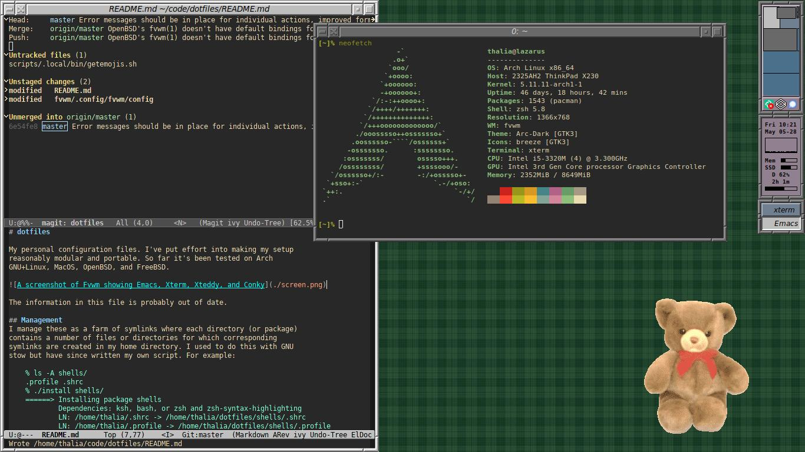

dotfiles
========

My personal configuration files.  My setup is reasonably modular and
portable and has been tested on lots of Linuxes, two BSDs, and MacOS.
While I have configurations for several window managers, I've put
effort into making sure that most program configs can be seamlessly
slotted into a pre-existing desktop setup.

The information in this file is probably out of date.

Management
============

I manage these as a farm of symlinks where each directory (or package)
contains a number of files or directories for which corresponding
symlinks are created in my home directory.  The `mk` and `unmk` scripts
create and remove symlinks respectively.  Both install all packages by
default but can take arguments.  Note that `unmk` doesn't yet know how
to remove symlinks that were renamed as will be discussed in the
shells section.

Commentary
==========

## XDG Base Directory Bigotry
I keep a clean ~.  A significant portion of my shell configuration is
dedicated to telling wayward programs to look for their files in the
appropriate XDG directories.

## A Note on Shells
I use Zsh as my preferred interactive shell because it is objectively
the best one with Bourne-shell compatible syntax, however occasionally
it makes sense to stick with a system's default (Bourne-compatible)
shell.  In this case ~/.zshenv may be renamed to, eg ~/.kshrc or
~/.bashrc, and ~/.profile may be created to source it for login
shells and export any required variables.

## Emacs Tweaks
I keep my Emacs config in ~/.config/emacs instead of ~/.emacs.d, which
only works for version >27.  To work with older versions of Emacs a
symlink is required:

    ln -s ~/.config/emacs ~/.emacs.d 

In order to reduce startup times and keep a nice, multi-headed, cache
of things I'm working on I like to start an Emacs daemon at login and
connect to it using the Emacsclient program.  Unfortunately there's a
GTK bug that causes it to crash in the (admittedly rare) event that X
dies, so I prefer to build it from source using the Lucid toolkit.  On
FreeBSD this means:

    sudo pkg install `pkg rquery %dn emacs` gnupg imagemagick7
	git clone https://git.savannah.gnu.org/git/emacs.git && cd emacs
	./autogen.sh
	./configure --with-x-toolkit=lucid --without-libgmp
	make && sudo make install

Ubuntu, and presumably Debian and its other derivatives, ship an
ancient version of Emacs; on these systems its dependencies can be
installed with:

    sudo apt-get install -y aspell aspell-en build-essential zlib1g-dev \
        lib{acl1,gnutls28,gpm,ncurses5,ncursesw5,xml2}-dev \
        lib{jpeg,png,gif,tiff}-dev

Emacs is close to the ideal environment for working with text,
however, because it is an overgrown text editor rather than, as some
of its fans would have you believe, a Lisp machine emulator,
unorthodox functionality like email, PDF views, music playback, and
Telegram chats require external dependencies.  This is in addition to
language-specific things like LSP servers and a Common Lisp compiler.

## X Window Managers and Desktop Environments
All essential stuff like my Xresources theme and keyboard layout
tweaks are sourced at startup from ~/.xsession.  I've been using
boring old KDE with its DM as my Emacs bootloader for a while now, so
in order to start a plain window manager from a tty with startx an
`exec` directive must be added to the bottom.  `startx $(which wm)`
also sort of works, however then ~/.xsession isn't sourced and must be
ran as a script by each WM's startup file.

## Freedesktop S&!t
The XDG utils and specifications are generally stupid and obtuse, so
my configurations for URL scheme handlers and default applications are
probably fragile.  Everything is in desktop/.config/mimeapps.list
though I should probably just write a script to auto-generate things,
god knows Firefox, Gimp, and LibreOffice love to walk all over it.
